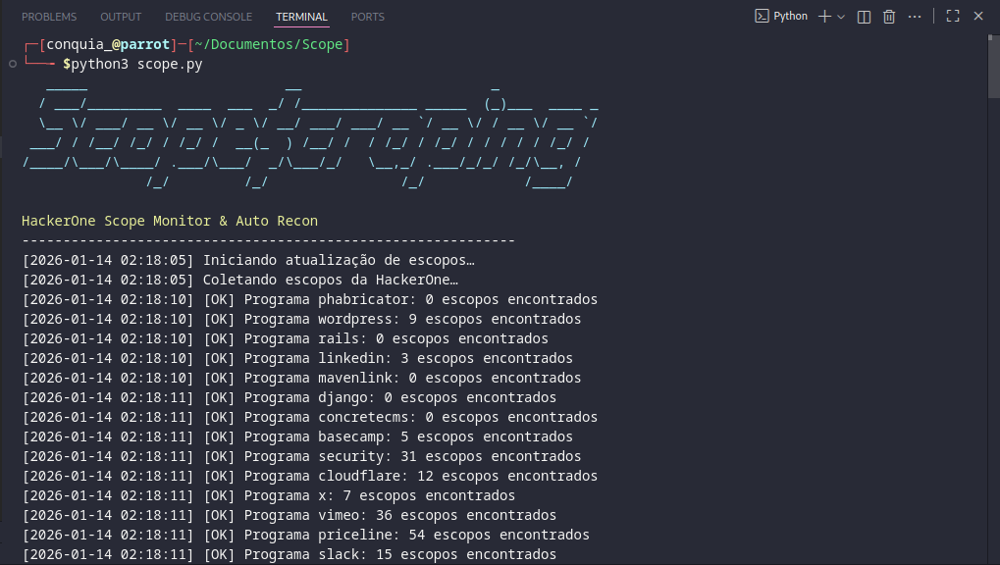

# Scope$craping



[](https://www.python.org/downloads/) 
[](LICENSE) 
[](#webhook-notifications)

HackerOne Scope Monitor & Recon Automation

Scope$craping é uma ferramenta completa para **monitoramento de escopos HackerOne**, detecção de mudanças e execução automatizada de recon usando ferramentas modernas de Bug Bounty.  

Ela permite que você:

- Detecte **escopos adicionados, removidos ou atualizados** em programas HackerOne.
- Execute recon completo em subdomínios, hosts ativos e URLs históricas.
- Organize resultados de forma limpa usando pastas separadas.
- Receba notificações via **Webhook no Discord**.

---

## Funcionalidades

- **Detecção de mudanças em escopos**
  - Novos escopos adicionados
  - Escopos removidos
  - Escopos atualizados
- **Recon automatizado**
  - Subdomínios (`subfinder`)
  - Hosts ativos (`httpx`)
  - URLs históricas (`waybackurls`)
- **Banco de dados SQLite** para persistência de escopos e resultados
- **Sistema de logs** detalhado
- **Pipeline modular** para adicionar novas etapas de recon facilmente
- **Multithreading** para acelerar processos
- **Webhook para Discord** para alertas instantâneos

---

## Pré-requisitos

- Python 3.11+
- Linux/macOS (Windows não testado oficialmente)
- Ferramentas externas:
  - [subfinder](https://github.com/projectdiscovery/subfinder)
  - [httpx](https://github.com/projectdiscovery/httpx)
  - [waybackurls](https://github.com/tomnomnom/waybackurls)
- Conta HackerOne com **API Token**

---

## Instalação

Clone o repositório e instale dependências:

```bash
git clone https://github.com/C0nqu14/ScopeScraping.git
cd ScopeScraping
pip install -r requirements.txt
````

Configure suas credenciais HackerOne como variáveis de ambiente:

```bash
export USERNAME="seu_username"
export API_TOKEN="seu_token"
```

---

## Estrutura de Diretórios

```
ScopeScraping/
├─ core/
│  ├─ api.py          # Funções para comunicação com HackerOne
│  ├─ logger.py       # Sistema de logs
│  └─ recon.py        # Pipeline de Recon
├─ recon_data/
│  ├─ subfinder/      # Resultados do subfinder
│  ├─ httpx/          # Resultados do httpx
│  └─ wayback/        # URLs coletadas do Wayback
├─ img/
│  └─ print.png       # Logo do projeto
├─ scope.py           # Script principal
├─ requirements.txt   # Dependências Python
└─ README.md          # Este arquivo
```

---

## Uso

### Executando o monitor de escopos

```bash
python3 scope.py
```

O script irá:

1. Coletar escopos de todos os programas HackerOne.
2. Detectar mudanças (adicionados, removidos, atualizados).
3. Atualizar o banco de dados SQLite.
4. Iniciar recon automático para cada escopo (subdomínios, hosts ativos, URLs históricas).

### Executando recon manual para um escopo

```python
from core.recon import ReconPipeline

pipeline = ReconPipeline()
pipeline.run("example.com")
```

Os arquivos gerados serão armazenados automaticamente em:

```
recon_data/
├─ subfinder/
├─ httpx/
└─ wayback/
```

---

## Webhook para Discord

Você pode configurar notificações via webhook para receber alertas sobre:

* Novos escopos
* Mudanças em escopos
* Resultados de recon

Exemplo de envio de notificação via Discord:

```python
import requests

WEBHOOK_URL = "sua_url_do_webhook"

data = {
    "content": "Novo escopo detectado: example.com"
}

requests.post(WEBHOOK_URL, json=data)
```

---

## Contribuição

Contribuições são bem-vindas! Você pode:

* Abrir issues para bugs ou melhorias
* Enviar pull requests
* Sugerir novas funcionalidades

---

## Licença

MIT License. Consulte o arquivo [LICENSE](LICENSE) para mais detalhes.

---

## Contato

João Conquia – [joaomanuelconquia@gmail.com](mailto:joaomanuelconquia@gmail.com)
LinkedIn: [www.linkedin.com/in/joão-conquia-6a7507239](https://www.linkedin.com/in/joão-conquia-6a7507239)
